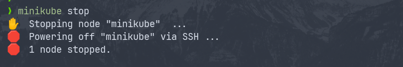
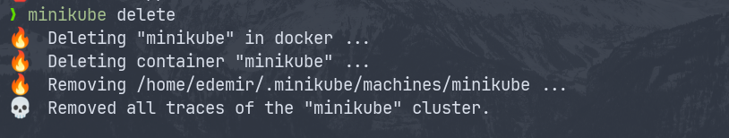

## Remover a infraestrutura do K8s

1. Para o Minikube.

```bash
minikube stop
```

<p align="center">
  
</p>

2. Excluir o Minikube.

```bash
minikube delete
```

<p align="center">
  
</p>

## Toda a infraestrutura foi removida.
