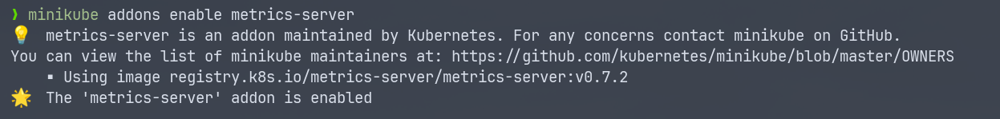
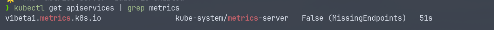
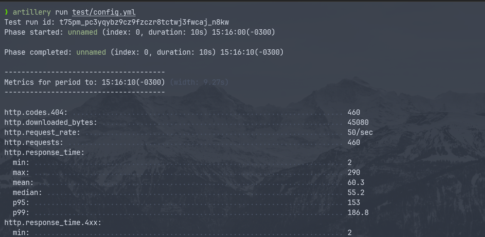
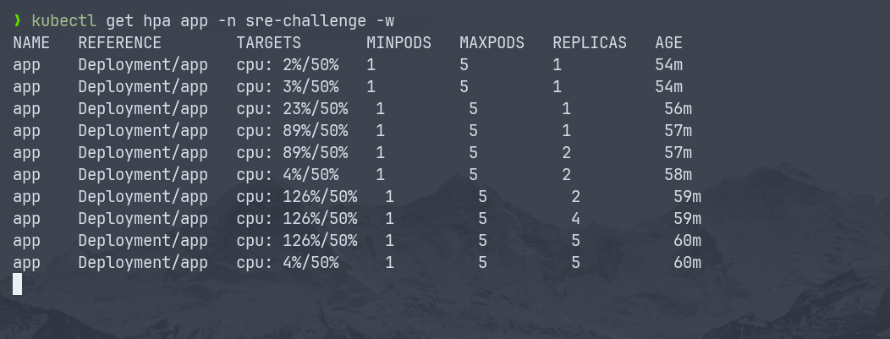

## Testes de Carga com Artillery

### Verificar o status do HPA

1. Habilitar o addon de métricas do Minikube:

```bash
minikube addons enable metrics-server
```

<p align="center">
  
</p>

2. Verificar se o Metrics Server está rodando corretamente:
   kubectl get apiservices | grep metrics

```bash
kubectl get apiservices | grep metrics
```

<p align="center">
  
</p>

3. Execute o seguinte comando para obter informações sobre o HPA:

```bash
kubectl get hpa app -n sre-challenge -w
```

4. Em outro terminal rode o seguinte comando do Artillery, utlizei o teste com a opção de 10 segundos, sinta-se a vontade para mudar o arquivo config.yml, lembre-se que é preciso informa o IP que o Minikube forneceu.

```bash
artillery run test/config.yml
```

<p align="center">
  
</p>

Agora verifique no terminal o resultado em tempo real.

<p align="center">
  
</p>

### Validamos o uso do HPA no K8S.
