### Rodar a aplicação no Minikube

1. Inicialize o Minikube.

```bash
minikube start
```

<p align="center">
  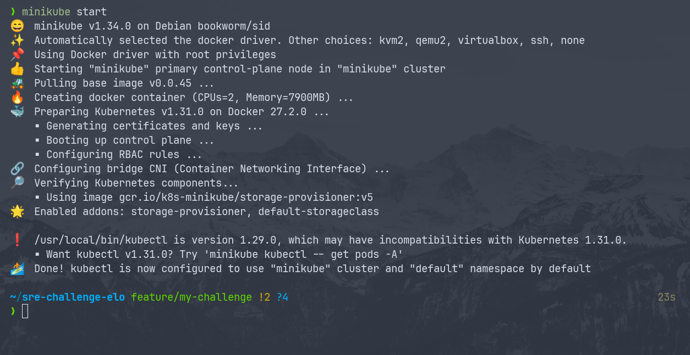
</p>

2. Criar ou atualizar um namespace no cluster Kubernetes

```bash
kubectl apply -f manifests/namespace.yaml
```

<p align="center">
  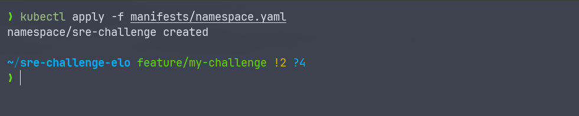
</p>

3. Aplicação de Múltiplos Manifests no Kubernetes

```bash
kubectl apply -f manifests/
```

<p align="center">
  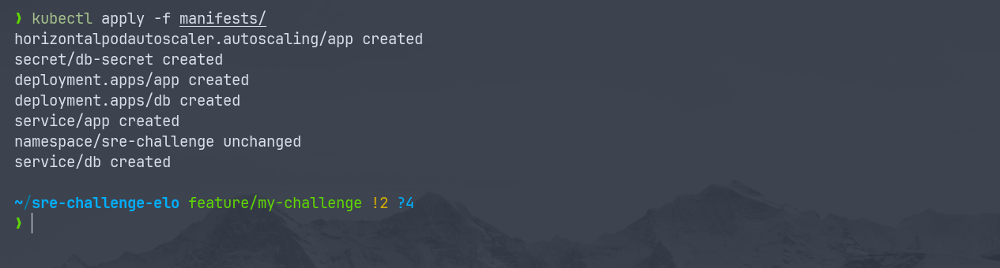
</p>

4. Listando os Services.

```bash
kubectl get svc -n sre-challenge
```

<p align="center">
  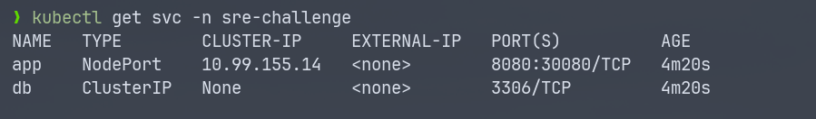
</p>

5. Listagem de Pods no Namespace da aplicação.

```bash
kubectl get pods -n sre-challenge
```

<p align="center">
  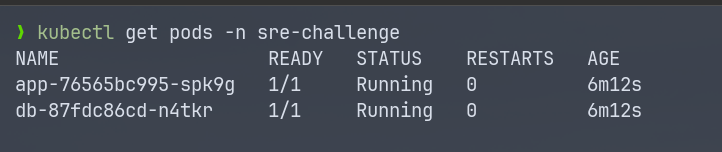
</p>

6. Verificar Logs da Aplicação
   Se os pods estão em execução, mas você ainda não consegue acessar o serviço, verifique os logs do pod da aplicação (app) para identificar se há erros internos na aplicação ou na configuração do serviço:

```bash
kubectl logs <nome-do-pod> -n sre-challenge
```

<p align="center">
  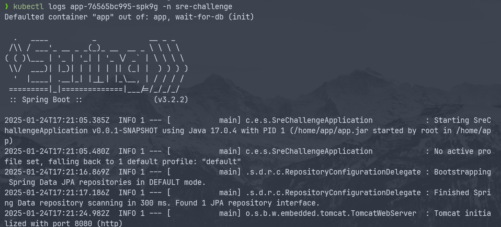
</p>

7. Verificar se a porta está aberta no Minikube
   Pode haver um problema com a forma como o Minikube está manipulando as portas. Se o NodePort não estiver mapeando corretamente, você pode tentar uma alternativa. Execute o comando para verificar se a porta está sendo mapeada corretamente:

```bash
minikube service app -n sre-challenge
```

- Isso abrirá automaticamente a URL do serviço em seu navegador. Caso não consiga, o comando fornecerá a URL para você copiar e colar.

- No seu terminal basta teclar Enter para voltar ao prompt.

<p align="center">
  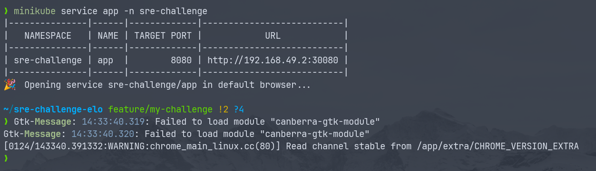
</p>

8. No seu navegador ficará assim no meu caso o endereço é esse: http://192.168.49.2:30080

<p align="center">
  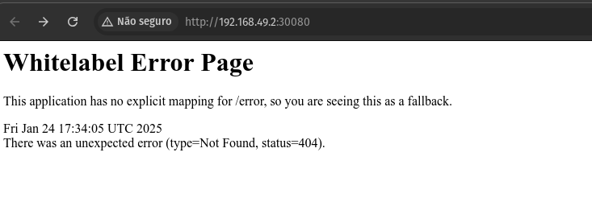
</p>

9. Vamos acessar a aplicação: http://192.168.49.2:30080/employee

<p align="center">
  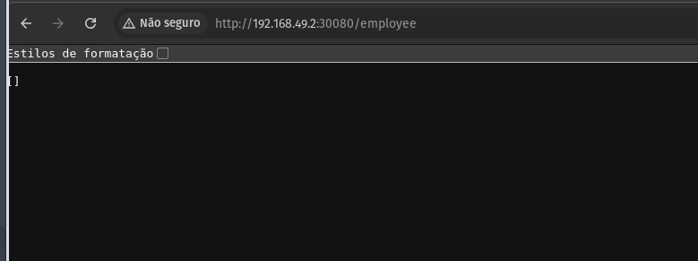
</p>

10. Vamos efetuar testes na aplicação

- acessar a aplicação pelo terminal

```bash
curl http://<IP-FORNECIDO-PELO-MINIKUBE>:30080/employee
```

- Incluir dados no Bando de Dados.

```bash
curl -X POST http://<IP-FORNECIDO-PELO-MINIKUBE>:30080/employee -H "Content-Type: application/json" -d '{"employeeName": "João", "employeeSalary": 5000.0}'
```

- Resultado do comando no terminal.

<p align="center">
  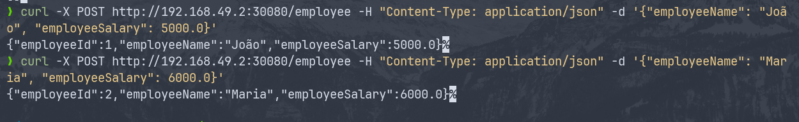
</p>

- Visualização no navegador.

<p align="center">
  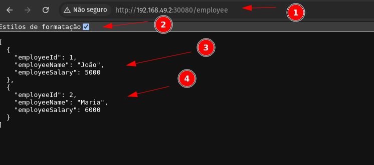
</p>

- Vamos remover o employeer 2 pelo terminal, com o comando:

```bash
curl -X DELETE http://<IP-FORNECIDO-PELO-MINIKUBE>:30080/employee/2
```

- Resultado no terminal.

<p align="center">
  
</p>

- Resultado no navegador.

<p align="center">
  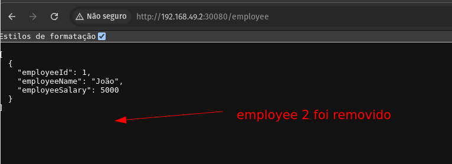
</p>

### Com estes teste validamos que a aplicação roda com os resquisitos pedidos e os dados são gravados no banco.
